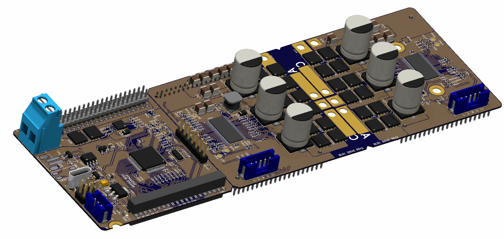

# Q_Motor_Driver_hw

A stackable BLDC motor controller board based and compatible with Odrive project (https://github.com/madcowswe/ODriveHardware).

Part of this project is based from azmat's single channel BLDC controller board (https://github.com/azmat-bilal/bldc_motor_controller_pcb.git)

## Introduction

This project includes 3 PCB boards as Main Board(MB), M0 Board(M0B) and M1 Board(M1B). 

- MB : Main controller, USB, CAN interface

- M0B : Gate driver for M0, 5V power supply for MB
- M1B : Gate driver for M1

MB is in between M0B and M1B which are connected by 2mm pitch socket and header. 

If only 1 axis needed the M1B can be removed. 

If more power is needed, simply redesign M0B or M1B with higher power FET's and put together with MB.

## Odrive compatibility

This project is supposed to be compatible with odrive v3.6-56V.

  

## Announcement

This project is still in development and need modification to be working as expected. 